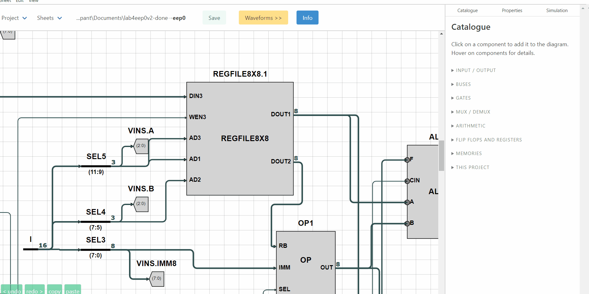

**File:** [SymbolUpdate.fs](src/renderer/DrawBlock/SymbolUpdate.fs) Lines 894-1066

**Context:** 

1. The code is admittedly quite hard to understand because of the many different cases that need to be considered for the specific operation (Moving ports of custom components).
    - However, this is the only long-section (more than 100 lines) of F# code I have written during my placement as my work so far wasn't very "F#-related" (new website, new build)
2. You can first check what the code does in ISSIE by CTRL+dragging a port of a custom component (OR by looking at the gif below)
3. With a few words the functions located on lines 894-1066:
    - Identify the new edge of a port as it is being dragged
    - Find the target position of the port as it is being dragged (where the port will be placed if you un-press the mouse key)     

  

